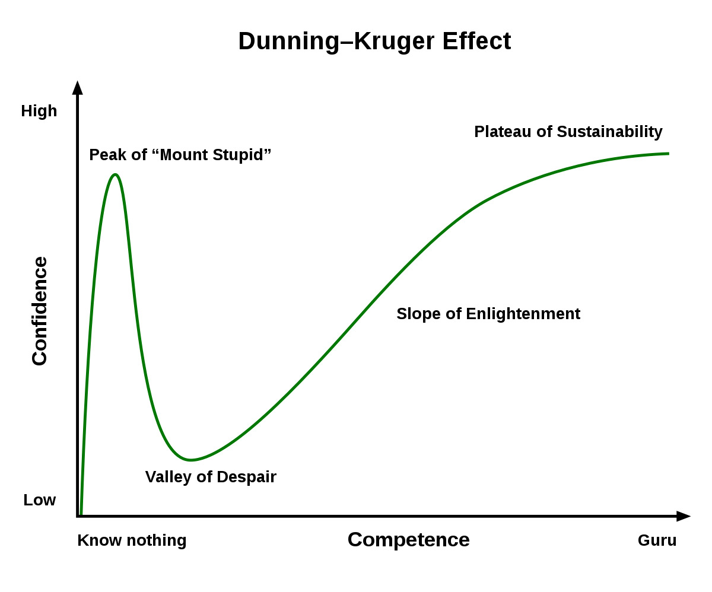

I've been working on a personal project for some time now, I have a MVP in place which I am proud of, but currently
it is running of a basic express server and storing JSON files locally. It was my first attempt at venturing into
full stack development without reference to tutorials, and I am proud of it. However, I am finding the transition to
full authentication and communication with a database, and getting all of that to work with redux to be a tall order.

I suppose that I should be happy to be in the Dunning-Kruger trough, as that means I've progressed!
 

However, up until now I have been relying mostly on the "learn only what you have to" style of learning
and primarily project based learning. This has helped me cover a lot of ground, but it's also causing me to become increasingly inefficient.

Now feels like a good time to slow down, and break down the different components I wish to learn into smaller projects. I aim to take those projects
as an opportunity to flesh out my understanding of the libraries/APIs I am using. Then, I can work on bringing all that knowledge together
when I return to developing my personal project. 

Here is my project list:
- [] express
  I want to start with improving my understanding of express. Then add on additonal functionality.