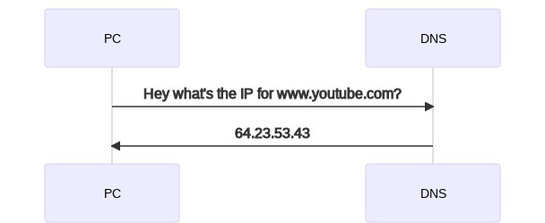
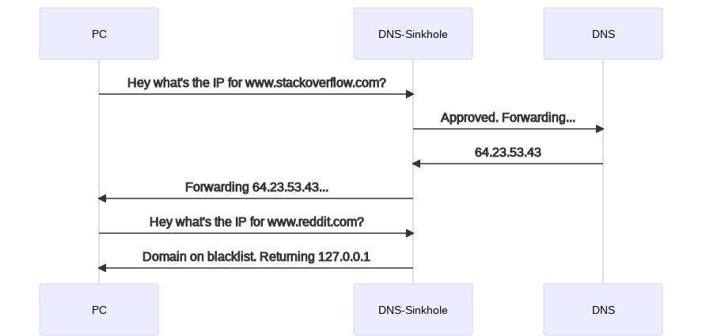
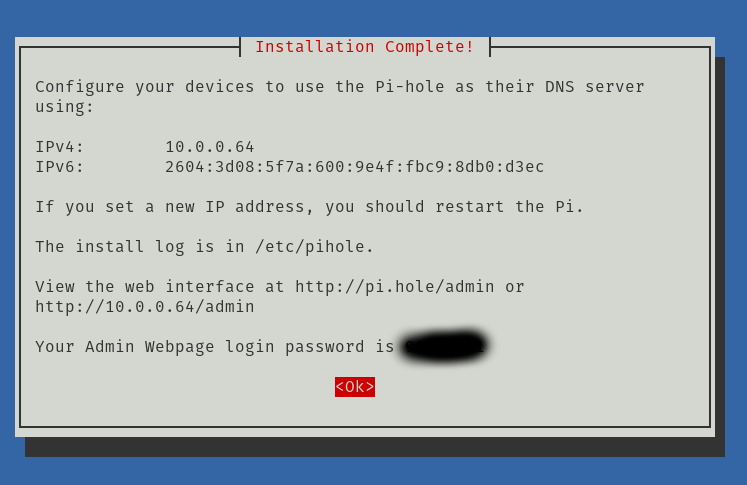
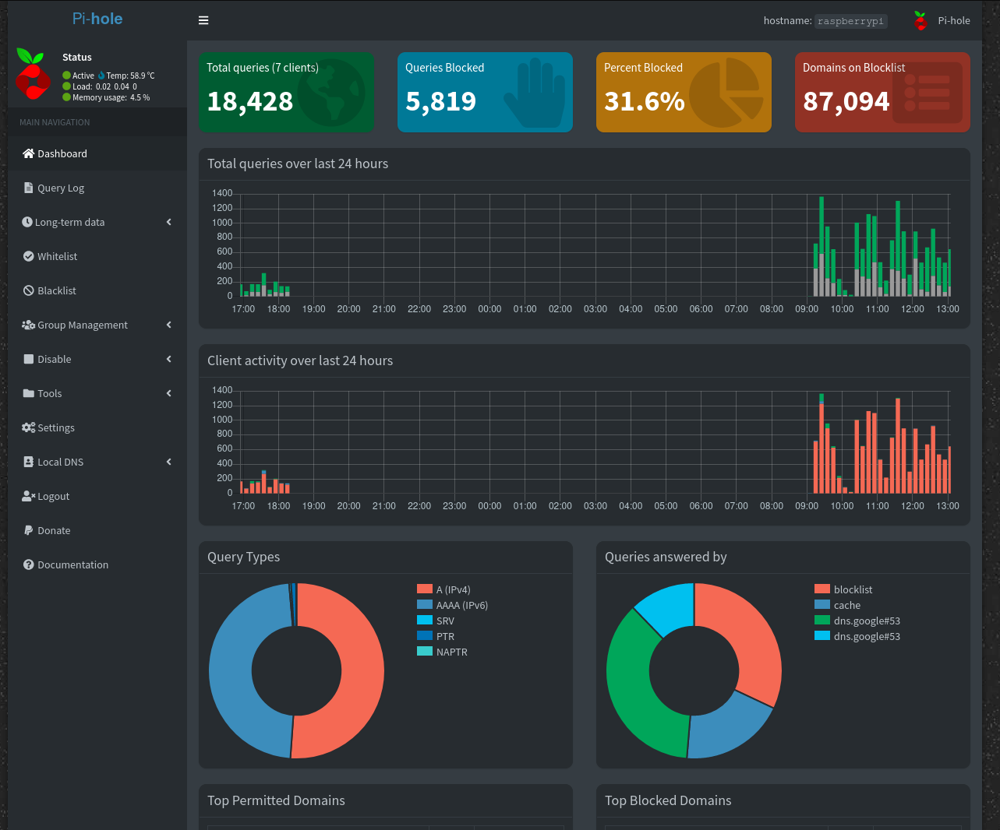
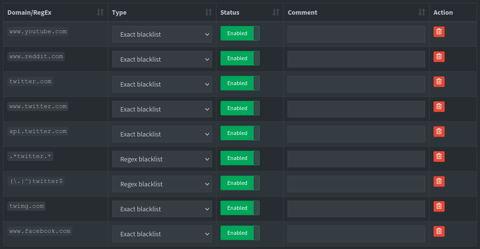

The internet has become a utility. But unlike the other utilities we use, we leave the internet running 24/7.

Our attention is one of our most precious resources, but almost every human being now has a computer in
their pocket that is virtually designed to siphon as much attention from us as possible.

We all have built up habits for how to responsibly use things like water, electricity, etc. You'd never leave your tap running all day, nor would you leave
your lights on when you go out of the house. We have yet to develop a proper set of habits for dealing with internet consumption.

As someone with ADHD, steering my attention is constant daily battle -- modern technology certainly does not make this any easier.

I decided that I wanted to find a way to make the internet more like a tap. Something that is **off** by default, and on only when I want to use it.
As a web developer, shutting off the entire internet would obviously not be very efficient, but I can think of a handful of websites I'd prefer not to have 24/7 access to.

I thought I would outline my present solution to this problem. So.. here we go.

## DNS Sinkhole

A DNS or Domain Name System converts the URL of whatever website we want to visit, into an IP address - that address corresponds to a server, which we send our requests to.

Here is a grossly oversimplified chart to illustrate:

Whereas a DNS Sinkhole acts as a kind of middleware between the regular DNS you would use, and can maintain it's own internal list of websites you do or do not want to visit.

This is very similar to what the hosts file does on windows/mac/linux machines. A proper DNS sinkhole can do more than return localhost, it can also be used to block trackers, ads, etc.
But I don't wanna make anymore mermaidjs charts so..

## Setting up PiHole

[PiHole](https://pi-hole.net/) is an open source DNS sinkhole which you can use to either replace the DNS on your router (and thus regulate network traffic across the entire network)
or you can manually add the DNS to the devices which you intend to control. I elected for the latter option.

I loaded a fresh raspberryPi OS onto a microsd card and initialized it.
using `raspi-config` I enabled ssh so I don't have to flip inputs on my monitor when I wanna check something.

I found the corresponding [documentation](https://docs.pi-hole.net/main/basic-install/) for PiHole and ran the installation script.
Selecting all the default installation options worked fine for me.

When the installation finishes, it shows you the address you can put into your browser to control PiHole via a web GUI.

Saving that password is important.

## Configuring the blacklist

Here's what the admin panel looks like

I created a combination of some exact match domains and a few regexs for some stickier requests that managed to get through.

## Toggling the "tap"

in order to access the websites I've blocked, I have to ssh into the Pi and run the following command:
`pihole disable <time>`

for example, 15m for 15 minutes, etc. etc.

It takes maybe 30 seconds for the DNS changes to update on my PC, and then I can temporarily access the websites.
The only website which managed to get through my defences, was twitter. In order to get around that, I had to modify the hosts file on my PC.
Once the PiHole is disabled, somehow twitter can get around my hosts file, but only then.

Why did that hack work? ¯\_(ツ)\_/¯ Anyway.

End result looks like this:

## Configuring Devices

Adding the DNS to my PC was easy, just modified the wifi network connection and added the IP of the PiHole.

For my android smart phone, adding it to the properties of my Wifi didn't seem to work.
So I found a free app called Hosts Go that allowed me to modify the DNS there, and then it wraps my connection inside a VPN.

## Final Thoughts

I think that this will improve the relationship I have with my internet enabled devices, happy with how this turned out.
One last issue was that unless I do a force refresh, or open/close the browser it seems to remain connected to the blacklisted sites.
As a workaround, I set a "break timer" for myself, which when it goes off I just close my browser.
